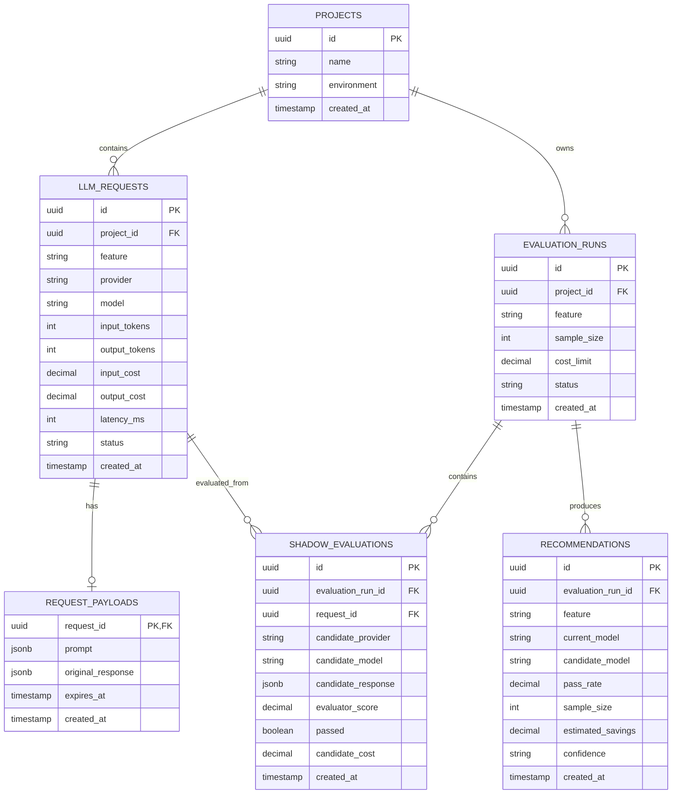

# Certiq AI — Project Status

## What this project is, in plain words

Certiq AI is a small tool that developers add to their own app's code. If a developer's app calls Anthropic or OpenAI to power a feature (a chatbot, a summarizer, anything), Certiq AI sits alongside that call and quietly keeps track of what it's costing. Later, the developer can ask it: "based on everything you've seen, could a cheaper model have handled some of this just as well?" If yes, it tells them exactly which feature to switch and roughly how much they'd save.

It runs entirely on the developer's own computer and their own database. Nobody else's server ever sees the data.

## Who it's for: developers and not end users

A solo developer or a small team building their own AI feature in Node.js/TypeScript, who doesn't want to sign up for a paid service or send their data to a third party just to see what their AI feature costs them. Not big companies — that's a different market with different tools already serving it.

## How it works, step by step

**Step 1 — The developer adds one line of code.**
Instead of calling `new Anthropic(...)` directly, they wrap it once:

```
const anthropic = wrapClient(new Anthropic({ apiKey: ... }), { feature: "chat-bot" });
```

Everything after that line looks and works exactly like it did before. The `feature: "chat-bot"` label is how Certiq AI knows which part of the app a call belongs to.

This same wrapping pattern works for OpenAI's client too — both Anthropic and OpenAI/GPT are supported from this first version, not added later. Each provider has its own thin adapter translating its specific request/response shape into one common format inside the wrapper, so the developer's code looks the same either way.

**Step 2 — Every real call still happens normally.**
The user's question goes to the real model, and the real answer comes back, at the same speed as always. Nothing about using the app changes.

**Step 3 — In the background, Certiq AI quietly writes down what happened.**
It does not slow down the response. It just notes: which feature, what it cost, how many tokens, how long it took.

**Step 4 — For a small sample of calls, it also tests a cheaper model.**
Not every call — just a sample, so this doesn't cost much extra. It sends the same prompt to a cheaper model, keeps the original answer untouched, and compares the two answers to see if the cheap one is "close enough."

**Step 5 — The developer runs one command whenever they want to check in.**
`Certiq AI analyze` reads everything stored so far and prints a report: cost by feature, and a plain suggestion like "switch this feature to a cheaper model, save about $170 a month."

**Step 6 — There's also a visual option.**
`Certiq AI dashboard` opens a small, temporary website on the developer's own computer, showing the same information with charts and filters. It shuts down when they're done. No account, no hosting, nothing left running afterward.

## The tech choices, and why

**Node.js and TypeScript only — no Python, anywhere.**
This was a deliberate choice, made after looking closely at what adding Python would cost:
- The developer's app is likely deployed somewhere like Vercel, which cannot run Python inside a normal Node function. Adding Python would mean running and maintaining a second, separate server just for that piece — doubling the places something could break, and doubling the debugging work.
- Python-based machine learning tools tend to be heavy — some single packages are hundreds of megabytes to a few gigabytes. That does not fit a tool meant to be light and quick to install.
- Python installs differently depending on the operating system, which turns a simple install into a source of setup problems for users.

Staying pure TypeScript keeps the install to a single, predictable command, and keeps the whole project inside one language and one set of tools.

**Postgres as the shared database, hosted by the developer, not by us.**
Because the developer's app usually runs on serverless infrastructure (like Vercel) which has no permanent local storage, the data has to live in a real, separately-hosted database instead of a file on someone's laptop. The developer sets up one free-tier hosted Postgres database and uses the same connection address in two places: inside their deployed app (so it can write data) and on their own computer (so the `analyze` command can read it). The two sides never talk to each other directly — they just both talk to the same database.

## The low-level plan for finding a cheaper model

1. Pick a batch of real, already-stored prompts for a given feature.
2. Send that whole batch to a candidate cheaper model, without touching the original responses.
3. Compare each pair of answers (original vs. cheap) and check what fraction of the batch counts as "close enough."
4. If the batch as a whole passes a set threshold, recommend that model for this feature. If not, try a different tier, and repeat.
5. Testing happens once per *batch*, not once per individual prompt moving up the ladder — this keeps the cost of testing itself small.

### How the starting point for that search gets picked

Climbing one tier at a time, always starting from the cheapest model, wastes effort — a feature that actually needs a strong model would fail several tests in a row every single time before landing on the right one. Two fixes, neither of which needs a trained prediction model:

- **Remember what worked last time.** Every past run of `analyze` already records which tier passed for a given feature. The next run starts the search at that same tier instead of at the bottom. If it still passes, the search is done in a single test. Only re-check neighboring tiers occasionally — say, every few runs, or if the feature's traffic pattern changes noticeably — to catch newly released cheaper models or a shift in what the feature is being used for.
- **For a brand-new feature with no history yet, search from the middle, not the bottom.** Start at a middle tier and move up or down depending on whether it passes or fails, instead of testing every tier in order from the cheapest. This finds the right tier in far fewer tests, using nothing more than basic search logic.

A further option, noted here as a possible refinement rather than a current plan: using cheap, rule-based signals (prompt length, presence of code or complex instructions) to guess a smarter starting tier before the first real test. This would still be an approximation, not a trained model, and would need to be labeled clearly as such if built.

**A true predictive router** — a model that looks at a prompt and directly predicts the right tier without running any real test — is a genuine, well-studied idea (this is essentially what the RouteLLM research project does). It has been intentionally left out of this plan for now: it needs a labeled dataset of real "this needed the expensive model" vs. "this didn't" examples to train or calibrate against, and that data only exists once the shadow-testing system above has been running for a while. This belongs with the other v2 items — worth revisiting once there's real usage history to build it from, not before.

## How answers get compared to each other

This went through a few rounds before landing on the current design. The short version is below — the full reasoning, including what was tried and ruled out along the way, is written up in the "Detailed tradeoff explanations" section at the end of this document.

**Step 1 — A fast, cheap first pass using SBERT.** Both answers get turned into a single embedding each, using a technique called SBERT, and compared with cosine similarity. This is fast, needs no heavy model, and can be trusted whenever the score comes back clearly high or clearly low.

**Step 2 — Anything in the uncertain middle gets escalated to a trained judge model.** SBERT alone is known to miss cases where two answers directly contradict each other with no obvious trigger word — for example, "sales increased" vs. "sales declined." So only the clear-cut comparisons get resolved by SBERT. Anything landing in an ambiguous middle range gets sent to a second, purpose-trained model — either AlignScore or BEM — built specifically to judge whether two answers agree or contradict, not just whether they're topically similar.

**Why not run the trained model on everything?** It's a much heavier model than a plain sentence encoder — hundreds of megabytes even after quantization — so reserving it for only the ambiguous cases keeps most comparisons fast and cheap, while still catching the harder cases a similarity score alone would miss.

Both AlignScore and BEM were checked and confirmed usable without any Python, run through an ONNX model runner inside Node.

## Things this plan intentionally leaves for later (v2 and beyond)

- **Smarter, automatic categorization of prompts**, instead of relying on the developer manually typing a `feature` name. A technique called BERTopic could do this — see the detailed explanation under "Showcase enhancements" below, including how it could be built as a separate, optional piece without breaking the core TypeScript-only install.
- **A true predictive router** that guesses the right model tier for a feature directly from the prompt, without running a real test first, once there's enough real shadow-testing history to train or calibrate it against.

## Current decisions and remaining questions

### Implementation status and scope boundary

The repository currently implements the package foundation, validated environment configuration, and the common provider adapter contract only. Provider adapter implementations, telemetry writes, Postgres schema, manual analysis flow, response evaluators, recommendations, and dashboard described below are Phase 1 target work and are tracked in `TODO.md` and Jira. They must not be described as available commands or supported runtime behavior until their implementation work is complete.

The Phase 1 target remains deliberately narrow: non-streaming text requests for Anthropic Messages, OpenAI Responses, and Gemini; permanent raw payload storage in the developer's Postgres database; manual analysis; best-effort Vercel telemetry; and report-only recommendations. Streaming, tool calls, structured outputs, multimodal requests, scheduled analysis, retention cleanup, automatic routing, predictive routing, BERTopic, and hosted demos remain deferred.

The following decisions now define the first implementation:

- Raw prompts and responses are stored by default because shadow evaluation cannot work without them.
- Development is split into two phases. Phase 1 stores all collected data permanently so the core collection, analysis, and reporting workflow can be solved first. Phase 2 adds configurable raw-payload TTLs and cleanup after the core is working.
- Scheduled analysis is not part of the current implementation. The developer runs `analyze` manually in Phase 1. An opt-in scheduled analysis workflow can be considered after the core evaluation flow is proven.
- The Phase 1 target supports Anthropic's Messages API, OpenAI's Responses API, and Gemini API for non-streaming text requests. Streaming, tool calls, multimodal inputs, and structured outputs are deferred.
- Model definitions and pricing live in one versioned configuration file. Each provider has an entry containing its models, tiers, prices, capabilities, and pricing effective date.
- Shadow testing runs through the manual `analyze` command in Phase 1, not during the live request. A future scheduled job may reuse the same analysis flow, but it is not part of the current implementation. Recommendations are report-only and never change production routing automatically.
- A candidate model must have at least 30 eligible examples to produce an early result, and at least 50 examples to produce a normal recommendation. The initial recommendation target is at least a 90% pass rate and at least 10% lower estimated cost. These numbers must be calibrated against hand-checked examples before being treated as reliable.
- Telemetry is best effort. A telemetry failure never changes or fails the original model response.
- On Vercel, telemetry is written directly to Postgres using background execution. The original response is returned without waiting indefinitely for the database write. A durable queue is not part of the current implementation.

The following still needs to be decided during implementation:

- Which exact current model IDs should be seeded in the model configuration, after checking the providers' official pricing pages.
- Which local web-server library should power the temporary dashboard.
- The exact SBERT and ONNX judge models, their licenses, and their compatibility with Node.
- The final score thresholds after the calibration set has been created.
- The Phase 2 retention period, cleanup trigger, and behavior for payloads currently being analyzed.

## Showcase enhancements (if this is being built to demonstrate skill, not just to be a lean product)

Everything above describes the leanest version of this project — built to solve one narrow problem for one specific developer, as cheaply and quickly as possible. If the actual goal shifts to demonstrating technical depth to recruiters and hiring managers — particularly for roles abroad, where a candidate is mostly judged from a repo and a README before any live conversation — several of the constraints applied above are worth relaxing. These are additions on top of the lean plan, not replacements for it:

- **A predictive router**, built out fully instead of left for later — see the "low-level plan" section above. Even a small, clearly-labeled proof-of-concept trained on synthetic or small real data is a strong signal of applied ML understanding, beyond API integration skill alone.
- **A visible, working CI/CD pipeline.** Automated linting, type-checking, and tests running on every code push (for example, via GitHub Actions), with a status badge shown on the README. This is one of the fastest things a reviewer notices, and shows production discipline rather than "it runs on my machine."
- **A public, hosted demo, not just a CLI.** Most reviewers will never install an npm package to try it. A version of the dashboard, deployed to a free hosting service and populated with realistic, clearly-labeled fabricated sample data (not a real account), lets anyone see the actual value within seconds of clicking a link.
- **A short system-design write-up on scaling.** Even though the real product stays intentionally small, a written section reasoning through "how would this handle far more volume" — database connection limits under serverless traffic, batching writes instead of one row per request, splitting data by customer — demonstrates the kind of thinking senior engineering interviews specifically probe for, without requiring that scale to actually be built.
- **A security and privacy considerations document.** The reasoning already done earlier in this project — choosing a time-limit on stored prompt text instead of an encryption key that would need its own security story, and why plain hashing alone wasn't sufficient — is exactly the kind of write-up that stands out, since most portfolio projects skip this entirely.

Two of these items need more explanation before they could actually be built:

### BERTopic as a separate, optional experiment that should not be implemented now

BERTopic is a way of automatically grouping large numbers of text entries into topics, without anyone manually labeling them ahead of time. It works by turning each piece of text into an embedding, grouping similar embeddings into clusters, and then picking out the words that best represent each cluster. Applied here, it could look at all the prompts stored across a developer's app and discover natural groupings on its own — potentially splitting a single "chat-bot" feature tag into several more precise sub-types automatically, something the current plan can only do if the developer manually creates multiple feature tags themselves.

The real complication: BERTopic's tooling lives entirely in the Python ecosystem, with no mature TypeScript equivalent — the same reasoning that ruled Python out of the core product in the first place. For a showcase version, the fix is to keep this piece **fully separate and optional, never bundled into the main pnpm install**:
- It would ship as its own separate script or small standalone tool, with its own separate setup instructions, clearly marked as an experimental add-on rather than part of the main product.
- A developer who wants to try it would need Python already installed on their machine, and would run a separate one-time setup step (something like a `pip install`) kept entirely outside the normal `pnpm add certiq-ai` flow.
- The core wrapper and CLI would work completely normally without this piece ever being installed — nothing in the main product depends on it.

The honest tradeoffs: this reintroduces every problem Python caused before (heavy dependencies, install differences across operating systems, a second toolchain to maintain) for this one optional piece, and it needs a meaningful amount of real prompt data before its groupings become stable and useful rather than noisy. It's still worth including in a showcase version despite those costs, because cleanly isolating the Python/TypeScript boundary and explaining the reasoning for doing so is itself a demonstration of judgment — showing it was deliberately isolated, not avoided out of unfamiliarity or bolted on carelessly. This should not be implemented now


### Architecture Decision Records (ADRs)

An Architecture Decision Record is a short, dated, written note capturing one specific decision made during a project: what was decided, what other options were seriously considered, and why the chosen option won. They're normally kept as small individual files inside the project's own repository, one per major decision, so anyone reading the code later can see not just what was built, but why it was built that way instead of some other way.

This project already has the raw material for several of these, since each major direction change involved real back-and-forth before landing on an answer. Turning each one into its own short file (for example, `docs/adr/0001-wrapper-not-proxy.md`, `docs/adr/0002-prompt-storage-ttl-not-encryption.md`, `docs/adr/0003-typescript-only-no-python.md`, `docs/adr/0004-response-comparison-method.md`) would take reasoning already worked out in this document and present it in the exact format engineers and technical interviewers expect to see in a serious project. The "Detailed tradeoff explanations" section below is effectively the first draft of what those individual ADR files would contain.

### Two more additions worth making, once everything above exists

- **A short technical blog post**, walking through the hardest decisions made along the way — the Python-vs-TypeScript tradeoff, the SBERT contradiction blind spot, why testing happens per batch instead of per prompt. Posted somewhere like dev.to or Hashnode and linked from the README and the resume. This is often what a recruiter or interviewer actually reads closely before a call, doing more work in a first-pass screen than the code itself.
- **Explicitly tying this project into the resume's existing narrative.** Alongside existing work on telemetry and RAG, this project should read as part of one continuous arc — telemetry, then retrieval, then a full evaluation and routing system — rather than three disconnected repos. Saying that arc out loud in a portfolio summary or resume line is worth more than letting a reviewer piece it together themselves.

## Detailed tradeoff explanations

The sections above give the short version of decisions made along the way. Some of these went through real back-and-forth before landing on a final answer — this section holds the full reasoning for the one that took the most turns, kept separate so the rest of the document stays quick to read. This is also, in effect, a preview of what an ADR for this decision would look like.

### How response comparison evolved: SBERT, then a hand-built hybrid, then a tiered design

The first idea was the simplest one: turn each answer into an embedding using SBERT, and compare the two with cosine similarity. This is fast and cheap, but has a documented weakness — it can rate two answers as "the same" even when one directly contradicts the other. Research backs this directly: one study tested popular sentence-embedding models against antonym-swapped sentence pairs (for example, "the horse is white" vs. "the horse is not white") and found they consistently rate such pairs as highly similar, because the sentences share almost all the same words and structure and differ by only one term. A separate study found that roughly a quarter of a widely-used similarity benchmark dataset contained pairs that were actually contradictions but had been mislabeled as similar, because embedding-based scoring quietly missed them.

To patch this, the next idea was a **hand-built hybrid**: keep SBERT as the main score, then add two extra rule-based checks on top — extracting numbers from both answers and comparing them directly, and checking whether one answer contains a negation word ("not," "never," etc.) that the other doesn't, penalizing the score if either check disagreed. This is cheap and fully rule-based, needing no extra model.

Looking closely at this hybrid, though, it left a real gap uncovered: **contradictions that don't use an explicit negation word at all** — for example, "sales increased" vs. "sales declined" — pass straight through both extra checks with no penalty, since neither number-matching nor a "does the text contain the word 'not'" check catches an antonym swap. Research on sentence embeddings specifically studies this case (calling it "implicit negation based on antonyms") as a separate, well-known failure distinct from explicit negation, and it isn't something a short list of negation trigger words can catch. On top of that gap, the hybrid also introduced three hand-picked numbers — how much weight to give the number-check, how much to penalize a negation mismatch, and the pass/fail threshold — that would need real labeled data to calibrate properly before they could be trusted at all.

The stronger fix: two models exist that were trained specifically on the task of judging whether two answers agree or contradict, rather than adapted from a general-purpose similarity task — AlignScore and BEM. Because their training data specifically included examples of contradiction and disagreement, they don't share the same blind spot as a generic embedding-based score. Both were checked and confirmed usable in Node without any Python, using an ONNX runtime.

Running either of these on every single comparison would be safer than the hybrid, but wasteful — they're much larger, heavier models than a plain sentence encoder, and most comparisons aren't actually ambiguous. The final design combines both ideas: use SBERT as a fast first pass, trust it when the score is clearly high or clearly low, and only send the genuinely uncertain, middle-range cases to AlignScore or BEM for a real judgment. This keeps most comparisons cheap and fast while still catching the harder cases a similarity score alone would miss — and it replaces the hand-built hybrid entirely, rather than sitting alongside it.


Nearly every choice made so far follows one rule: **solve the problem the actual target developer has, and cut anything that doesn't serve that.** Several earlier directions were removed for exactly this reason — a much bigger "do everything" platform, consumer apps unrelated to this problem, and a version of this tool built around AI coding assistants like Claude Code instead of a developer's own app. Each was dropped once it became clear it either duplicated something already built by someone else, or added a real problem (data storage, extra infrastructure, session tracking) that only existed because of that direction — not because the actual target user needed it.

## Implementation planning decisions

### Two-phase development plan

The first priority is proving the core workflow end to end. Adding deletion rules before collection and evaluation work reliably would make it harder to debug whether a missing result came from the product or from retention cleanup.

#### Phase 1 — Permanent storage and core evaluation and all the other stuffs

Phase 1 stores the collected data permanently. The developer can run `analyze` manually whenever they want:

```
live model request
    -> telemetry is written to Postgres
    -> `analyze` selects stored requests
    -> candidate models are tested
    -> responses are compared
    -> evaluation results and recommendations are stored
```

There is no TTL cleanup in this phase. This makes the first implementation easier to inspect and ensures that data is not lost while the core workflow is being developed and tested.

Permanent storage is a deliberate development tradeoff, not the final privacy policy. The documentation must clearly warn that prompts and responses remain in the developer's database until Phase 2 is implemented or the developer deletes them manually.

#### Phase 2 — Retention and cleanup

After the core workflow is working, raw payloads receive a configurable expiration time:

```
collect payload with expires_at
    -> analyze available requests
    -> store evaluation results
    -> delete expired raw payloads
    -> keep durable metadata and recommendations
```

Phase 2 will decide the default TTL, cleanup trigger, whether active analysis can temporarily reserve a payload, and how late-arriving telemetry is handled. Scheduled analysis is also deferred until this phase has a clear retention policy; it must be opt-in because shadow testing creates additional model-provider costs.

### Where telemetry flushing fits

Telemetry is collected by the wrapper after the original provider response is received. The original response is always the primary operation; recording what happened is secondary.

For the Vercel deployment, the wrapper uses background execution to attempt a direct Postgres write after the original model response is ready. The application returns the original response without waiting indefinitely for telemetry. If the write succeeds, the event is stored. If it fails, times out, or the platform terminates the background work, the event is logged as dropped and the original model response is still returned.

This is a best-effort write, not guaranteed delivery. A durable queue could improve delivery later, but it would add another service and deployment to the project. The first implementation deliberately keeps the architecture smaller and uses Vercel background execution plus direct Postgres.

There is no retry loop inside the original user request. Retries can multiply database load and delay the application when the database is already unhealthy. A later repair mechanism can be considered if telemetry loss becomes a demonstrated problem.

### Model configuration

All supported models and prices are kept in one versioned configuration file rather than being scattered through the source code. Each provider has its own entry in the file, and each model has a tier and capability list:

```json
{
  "providers": [
    {
      "id": "anthropic",
      "models": [
        {
          "id": "model-id",
          "tier": 1,
          "inputPricePerMillionTokens": 0,
          "outputPricePerMillionTokens": 0,
          "capabilities": ["text"],
          "pricingEffectiveFrom": "2026-01-01"
        }
      ]
    },
    {
      "id": "openai",
      "models": []
    }
  ]
}
```

The actual model IDs and prices must be checked against the providers' official pricing at implementation time. The request and evaluation records also store the exact model ID and prices used at that time, so later configuration changes do not rewrite historical cost reports.

### How payloads are stored

Sensitive payloads are kept in a separate table from durable request metadata. This makes retention cleanup straightforward:

- `llm_requests` keeps feature, provider, model, token, cost, latency, status, and timestamp information.
- `request_payloads` keeps the original prompt and response. In Phase 1 it is permanent; Phase 2 adds an `expires_at` value and cleanup.
- `shadow_evaluations` keeps candidate results and evaluator scores, with its own payload-retention policy for candidate responses.
- `evaluation_runs` keeps the batch-level configuration and status.
- `recommendations` keeps the durable report result.

In Phase 1, payload rows are not deleted automatically. In Phase 2, the cleanup job will delete expired payload rows but keep request metadata, evaluation summaries, and recommendations. If scheduled analysis is added later and a run fails, cleanup must leave the relevant payloads in place for a later run.

### Database relationships



### Implementation order after the foundation

Phase 1 implementation order:

1. Create the TypeScript package and CLI entry point.
2. Add the Anthropic and OpenAI provider adapters for non-streaming text requests.
3. Define the normalized event schema.
4. Add Postgres migrations and permanent payload storage.
5. Add Vercel background telemetry writes with timeouts and failure isolation.
6. Add the model configuration file and versioned pricing.
7. Implement `analyze`, candidate selection, and batch shadow evaluation.
8. Add the evaluator interface, calibration fixtures, SBERT, and the ONNX judge.
9. Persist evaluation runs and report-only recommendations.
10. Add confidence and insufficient-data handling.
11. Build the local dashboard on top of the report queries.
12. Add TLS configuration, security documentation, tests, CI, and a README.

Phase 2 implementation order:

1. Add `expires_at` and configurable payload retention.
2. Add cleanup and manual deletion commands.
3. Protect payloads currently being analyzed from cleanup.
4. Decide whether scheduled analysis is needed and make it explicitly opt-in.
5. Add retention monitoring and warnings when payloads approach expiration.

Streaming, tool calls, multimodal inputs, automatic routing, BERTopic, and predictive routing remain separate follow-up work in `TODO.md`.
